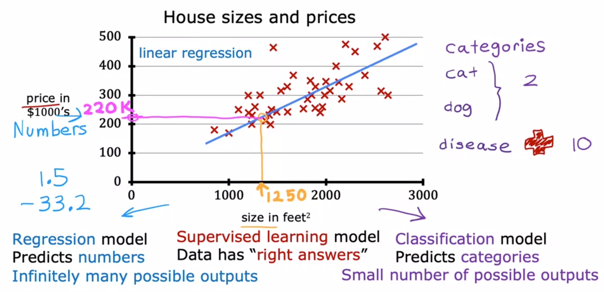
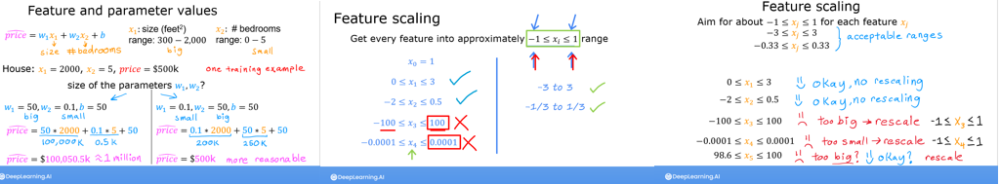

# Machine Learning

## TOC
* Supervised learning
  * Classification
    * Logistic Regression (Sigmoid function)
    * Decision boundary
  * Regression
    * Linear Regression
    * Polynomial Regression
* Unsupervised learning
  * Clustering (identifying patterns in data)
* Vectorization

## Regression
A Regression model redicts numbers, such as house prices.

Most widely used

Used when predicting: House prices, 

### Possible functions/models for regression

* Linear
  * Univariate linear regresion (one variable linear regression)
    * f(x) = wx + b
  * Multivariable linear regression
  $$f_{\mathbf{w},b} = w_0x_0 + w_1x_1+ ... + w_{n-1}x_{n-1} + b \tag{1}$$

### Linear Regeression (one variable)

1) Model 
2) Cost Function
3) Gradient descent
4) Gradient for w
5) Gradient for b

***Linear Regression*** model : $f_{w,b}(x^{(i)})$, where the ***Model Parameters*** are $w$, $b$ 

$$f_{w,b}(x^{(i)}) = wx^{(i)} + b \tag{1}$$
$f_{w,b}(x^{(i)})$ 
$y^{(i)}$. 

The ***Cost Function***: $cost$, $J(w,b)$. calculates the cost for the ***Training Dataset*** where each entry is denoted as $x^{(i)},y^{(i)}$
$$J(w,b) = \frac{1}{2m} \sum\limits_{i = 0}^{m-1} (f_{w,b}(x^{(i)}) - y^{(i)})^2\tag{2}$$ 

***Gradient Descent*** is a process used to identify the lowest cost for parameters $w$, $b$ described as:

$$\begin{align*} \text{repeat}&\text{ until convergence:} \lbrace \newline
 w &= w -  \alpha \frac{\partial J(w,b)}{\partial w} \tag{3}  \newline 
 b &= b -  \alpha \frac{\partial J(w,b)}{\partial b}  \newline \rbrace
\end{align*}
$$

where, parameters $w$, $b$ are updated simultaneously.  

The ***Gradient*** is defined as 

$$
\begin{align}
\frac{\partial J(w,b)}{\partial w}  &= \frac{1}{m} \sum\limits_{i = 0}^{m-1} (f_{w,b}(x^{(i)}) - y^{(i)})x^{(i)} \tag{4}\\
  \frac{\partial J(w,b)}{\partial b}  &= \frac{1}{m} \sum\limits_{i = 0}^{m-1} (f_{w,b}(x^{(i)}) - y^{(i)}) \tag{5}\\
\end{align}
$$

### Cost function
Linear Regression we have used the squared error cost function
 $$J(w,b) = \frac{1}{2m} \sum\limits_{i = 0}^{m-1} (f_{w,b}(x^{(i)}) - y^{(i)})^2$$ 

 Following the derivative of the cost leads to the minimum - basis for ***gradient descent*** for ***linear regression***.

## Gradient descent
***Gradient Descent*** is the process of identifying the correct parameter/feature weights.

If creating a model predicting the price of a house and you use area and age of the house as the inputs (x_1 and x_2) of a linear regression model - what should the w_1 and w_2 (parameter weights) be set to to best fit the available training data.

<figure>
    
</figure>

### Learning Rate ($\alpha$)
The ***Learning Rate*** is the value used to increment the parameter weights for each iteration of ***Gradient Descent***.

### Feature Scaling
***Feature Scaling*** is the process of scaling the feature values to better fit the model.

> You want to fit every feature into the range of `-1 <= x => 1`

Having a suitable range of input values speeds up ***Gradient Descent*** and levels out the various inputs (x_1, ... x_m).

Since the learning rate ($\alpha$) is the same for all iterations, but since some inputs can have very large numbers, the 

<figure>
    
</figure>

- Feature scaling, essentially dividing each positive feature by its maximum value, or more generally, rescale each feature by both its minimum and maximum values using (x-min)/(max-min). Both ways normalizes features to the range of -1 and 1, where the former method works for positive features which is simple and serves well for the lecture's example, and the latter method works for any features.
- Mean normalization: $x_i := \dfrac{x_i - \mu_i}{max - min} $ 
- Z-score normalization which we will explore below. 

## Vectorization
Makes the code shorter and the processing more effecient (paralellization)

<figure>
    
</figure>

<figure>
    
</figure>

### Dot Product
>The dot product multiplies the values in two vectors element-wise and then sums the result. Vector dot product requires the dimensions of the two vectors to be the same.

$$ x = \sum_{i=0}^{n-1} a_i b_i $$

<figure>
    
</figure>